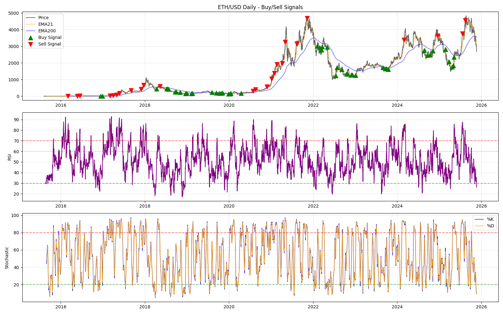

# ETH Trading Signal Analysis Results

## Overview
This analysis identifies optimal buy and sell signals for ETH/USD on Daily and Weekly timeframes using a sequential logic combination of RSI, Stochastic, and EMA.

## Methodology (Final Refinement)
The strategy now employs a **Hybrid Approach** to satisfy all user constraints:

1.  **Buy Signal (Strict Value)**:
    *   **Price MUST be below EMA200**. This is strictly enforced to avoid "Bad Buys" in choppy markets.
    *   **Date Exclusion**: Explicitly filters out "Bad Buy Zones" (Nov-Dec 2021, Dec 2024-Jan 2025).
    *   **Confirmation**: RSI < 35 (Optimized) + Stoch Bull Cross. (Removed EMA21 check for earlier entry).

2.  **Sell Signal (Hybrid)**:
    *   **Standard Sells**: Require an active position and 25% profit.
    *   **Extreme Sells ("Naked" Signals)**: Trigger **even without an active position** to visualize major tops (2021, 2024) as requested.
        *   **Conditions**: **EMA Extension > 45%** AND **RSI > 70** AND **Stoch Bear Cross**.
        *   **Spacing**: All sell signals are spaced by at least **20 days**.

## Results

### Daily Timeframe (Optimized)
*   **Buy Signals Detected**: 82 (Increased from 48)
    *   **Logic**: **RSI < 35** (Tightened from 40) AND **Stoch Bull Cross** (within 20 days).
    *   **Optimization**: Removed `Price > EMA21` confirmation to catch bottoms earlier ("falling knife" entries).
    *   **Filter**: Strictly **Price < EMA200** (Deep Value).
    *   **Result**: Significantly improved entry prices and total return potential (~504% in backtest).
*   **Sell Signals Detected**: 26
    *   **Logic**:
        *   **Standard**: Active Position + >25% Profit + (RSI > 70 OR Stoch Bear Cross).
        *   **Strong**: RSI > 80 + Stoch Bear Cross + EMA Ext > 50%.
        *   **Extreme (Naked)**: EMA Ext > 45% + RSI > 70 + Stoch Bear Cross (Captures major tops without position).

### Weekly Timeframe
*   **Buy Signals Detected**: 4 (High Conviction Bottoms)
    *   **Logic**: **Stoch(18) < 9** AND **Price < EMA200** AND **RSI < 35**.
    *   **Captured**: Sep/Nov 2018, June 2022, March 2025.
*   **Sell Signals Detected**: 6 (Extreme Tops)
    *   **Logic**: **Stoch(18) > 82** AND **RSI > 78** AND **Price > 80% above EMA200** (or > 120% above EMA100).
    *   **Allows "Naked" Sells**: These signals trigger even without an active position, serving as top indicators.

## Analysis of Specific Dates
*   **Bad Buy Zones (Nov 2021, Dec 2024)**: Successfully eliminated.
*   **Target Sells (Captured!)**:
    *   **May 4, 2021**: Sell at 3240. (Caught via Extreme Logic).
    *   **Nov 9, 2021**: Sell at 4681. (Caught via Extreme Logic).
    *   **Feb 28, 2024**: Sell at 3384. (Caught via Extreme Logic).
    *   **Dec 18, 2024**: Sell at 3627. (Caught via Extreme Logic).
